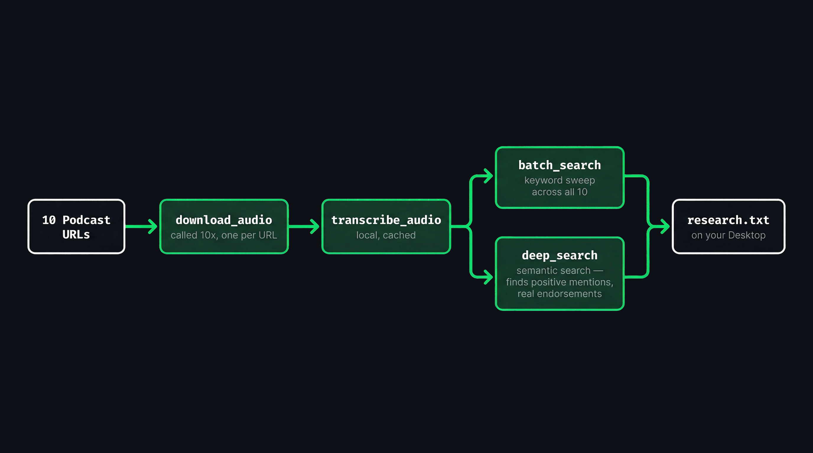

<p align="center">
  
</p>

<h1 align="center">Augent</h1>

<p align="center">
  <a href="https://github.com/AugentDevs/Augent/releases/latest"></a>
  <a href="https://github.com/AugentDevs/Augent/actions/workflows/tests.yml"></a>
  <a href="https://www.python.org/downloads/"></a>
  <a href="https://opensource.org/licenses/MIT"></a>
  
</p>

<p align="center"><strong>Audio intelligence for Claude Code agents and agentic swarms</strong><br>Built by <a href="https://augent.app">Augent</a></p>

<p align="center">An MCP plugin that searches any content the way you search text<br>by speaker, keyword, or topic. Hours of content, seconds to find it.<br>Fully local, fully private.</p>

---

## Install

```bash
curl -fsSL https://augent.app/install.sh | bash
```

Works on macOS and Linux. Installs everything automatically.

**Windows:** `pip install "augent[all] @ git+https://github.com/AugentDevs/Augent.git"`

**[Documentation](https://docs.augent.app)** — Full reference for all tools, CLI commands, and API

---

<p align="center">
  
</p>

---

## Usage

| Mode | Best For |
|------|----------|
| **Claude Code (MCP)** | Agentic workflows with all 14 tools — one prompt does everything |
| **CLI** | Terminal-based searches and batch processing |
| **Web UI** | Visual interface for manual uploads and searches — runs 100% locally |

---

## Claude Code (MCP)

The primary way to use Augent. Claude Code gets direct access to all 14 audio intelligence tools.

### Setup

Add to `~/.claude.json` (global) or `.mcp.json` (project):

```json
{
  "mcpServers": {
    "augent": {
      "command": "python3",
      "args": ["-m", "augent.mcp"]
    }
  }
}
```

Restart Claude Code. Run `/mcp` to verify connection.

**Note:** If `python3` isn't found, use full path (e.g., `/usr/bin/python3` or `/opt/homebrew/bin/python3`).

### MCP Tools

| Tool | Description |
|------|-------------|
| `download_audio` | Download audio from video URLs at maximum speed (YouTube, Vimeo, TikTok, etc.) |
| `transcribe_audio` | Full transcription with metadata |
| `search_audio` | Find keywords with timestamps and context snippets |
| `deep_search` | Search audio by meaning, not just keywords (semantic search) |
| `take_notes` | Take notes from any URL with style presets |
| `chapters` | Auto-detect topic chapters in audio with timestamps |
| `batch_search` | Search multiple files in parallel (for swarms) |
| `text_to_speech` | Convert text to natural speech audio (Kokoro TTS, 54 voices, 9 languages) |
| `search_proximity` | Find where keywords appear near each other |
| `identify_speakers` | Identify who speaks when in audio (speaker diarization) |
| `list_files` | List media files in a directory |
| `list_cached` | List cached transcriptions by title |
| `cache_stats` | View transcription cache statistics |
| `clear_cache` | Clear cached transcriptions |

**[Full tool reference →](https://docs.augent.app/tools/download-audio)**

### Examples

**Notes + voice:**
> *"Take notes from this lecture and read them back to me as audio: https://youtube.com/watch?v=..."*

**Ad angle research:**
> *"Download these 10 podcasts and find every moment a host covers a product in a positive or unique way. Not just brand mentions, only real endorsements or life-changing recommendations. Give me the timestamps and exactly what they said: url1, url2, url3, url4, url5, url6, url7, url8, url9, url10"*

<p align="center">
  
</p>

---

## CLI

For terminal-based usage. Works standalone or inside Claude Code.


### Commands

| Command | Description |
|---------|-------------|
| `audio-downloader "URL"` | Download audio from video URL (speed-optimized) |
| `augent search audio.mp3 "keyword"` | Search for keywords |
| `augent transcribe audio.mp3` | Full transcription |
| `augent proximity audio.mp3 "A" "B"` | Find keyword A near keyword B |
| `augent cache stats` | View cache statistics |
| `augent cache list` | List cached transcriptions |
| `augent cache clear` | Clear cache |
| `augent help` | Show full help |

---

## Web UI

Visual interface for manual use. Runs 100% locally - no cloud APIs, no Claude credits.

```bash
python3 -m augent.web
```

Open: **http://127.0.0.1:9797**

1. **Upload** an audio file (MP3, WAV, M4A, etc.)
2. **Enter keywords** separated by commas
3. **Click SEARCH**
4. **View results** with timestamps and context

| Command | Description |
|---------|-------------|
| `python3 -m augent.web` | Start on port 9797 |
| `python3 -m augent.web --port 3000` | Custom port |
| `python3 -m augent.web --share` | Create public link |


---

## Caching

Transcriptions are cached by file hash + model size. Same file = instant re-search. Cache persists across sessions.

---

## Export Formats

JSON, CSV, SRT, VTT, Markdown. Use `--format` with any CLI command.

---

## Model Sizes

**`tiny` is the default** and handles nearly everything. Use `small` or above only for heavy accents, poor audio, or lyrics.

| Model | Speed | Accuracy |
|-------|-------|----------|
| **tiny** | Fastest | Excellent (default) |
| base | Fast | Excellent |
| small | Medium | Superior |
| medium | Slow | Outstanding |
| large | Slowest | Maximum |

---

## Contributing

PRs welcome. Open an [issue](https://github.com/AugentDevs/Augent/issues) for bugs or feature requests.

---

## License

MIT License - see [LICENSE](LICENSE) for details.
