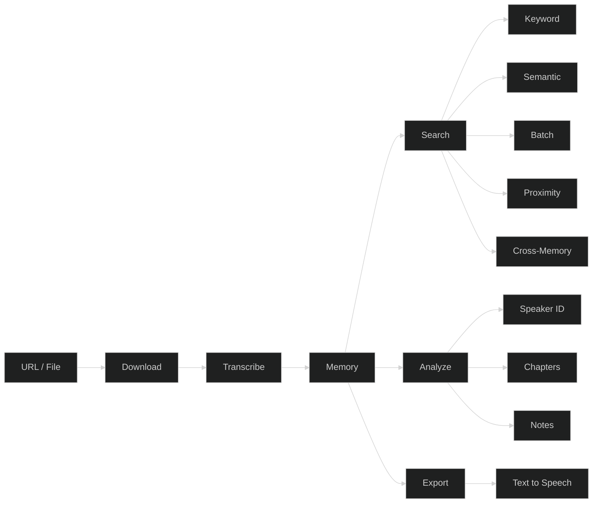

# Augent — The Audio Layer for Agents

<p align="center">
  <picture>
    
  </picture>
</p>

<p align="center">
  <strong>Any amount of content, seconds to find it. Fully local, fully private.</strong>
</p>

<p align="center">
  <a href="https://github.com/AugentDevs/Augent/actions/workflows/tests.yml"></a>
  
  <a href="https://www.python.org/downloads/"></a>
  <a href="https://opensource.org/licenses/MIT"></a>
</p>

<p align="center">
  <a href="#install">Install</a> ·
  <a href="#mcp-tools">MCP Tools</a> ·
  <a href="#cli">CLI</a> ·
  <a href="#web-ui">Web UI</a> ·
  <a href="https://docs.augent.app">Docs</a>
</p>

**Augent** turns any audio or video source into structured, searchable intelligence for agents. Search by keyword, speaker, topic, or meaning. Identify who's talking, break content into chapters, take formatted notes, read them back with text-to-speech, and more. One install, full pipeline, entirely on your machine.

Raw URL to answer in a single prompt. Every transcription stays in memory. First run transcribes, every search after that is instant. Batch process entire libraries with no file limit. If it's buried in audio, Augent finds it. Compatible with any MCP client. First-class support for Claude Code.

[Website](https://augent.app) · [Docs](https://docs.augent.app) · [Getting Started](https://docs.augent.app/getting-started) · [Tool Reference](https://docs.augent.app/tools/download-audio) · [Changelog](CHANGELOG.md)

<br />

## Install

```bash
curl -fsSL https://augent.app/install.sh | bash
```

Works on macOS and Linux. Installs everything automatically.

**Windows:** `pip install "augent[all] @ git+https://github.com/AugentDevs/Augent.git"`

<br />

<p align="center">
  <picture>
    
  </picture>
</p>

<br />

## How It Works



## Project Structure

```
augent/
├── mcp.py          # MCP server — tools for Claude
├── core.py         # Transcription engine (faster-whisper)
├── search.py       # Keyword search
├── embeddings.py   # Semantic search + chapters
├── speakers.py     # Speaker diarization
├── tts.py          # Text-to-speech (Kokoro)
├── memory.py       # Three-layer memory (SQLite)
├── cli.py          # CLI interface
├── web.py          # Web UI (Gradio)
├── export.py       # Export formats (JSON, CSV, SRT, VTT, MD)
└── clips.py        # Audio clip extraction
```

<br />

## MCP Tools

The primary way to use Augent. Any MCP client gets direct access to all tools.

Add to `~/.claude.json` (global) or `.mcp.json` (project):

```json
{
  "mcpServers": {
    "augent": {
      "command": "augent-mcp"
    }
  }
}
```

Restart Claude Code. Run `/mcp` to verify connection.

| Tool | Description |
|:-----|:------------|
| `download_audio` | Download audio from video URLs at maximum speed (1,000+ supported sites) |
| `transcribe_audio` | Full transcription with metadata |
| `search_audio` | Find keywords with timestamps and context snippets |
| `deep_search` | Search audio by meaning, not just keywords (semantic search) |
| `take_notes` | Take notes from any URL with style presets |
| `chapters` | Auto-detect topic chapters in audio with timestamps |
| `batch_search` | Search multiple files in parallel — built for batch workflows and agent swarms |
| `text_to_speech` | Convert text to natural speech audio (Kokoro TTS, 54 voices, 9 languages) |
| `search_proximity` | Find where keywords appear near each other |
| `identify_speakers` | Identify who speaks when in audio (speaker diarization) |
| `search_memory` | Search across ALL stored transcriptions by keyword or meaning |
| `list_files` | List media files in a directory |
| `list_memories` | List stored transcriptions by title |
| `memory_stats` | View transcription memory statistics |
| `clear_memory` | Clear stored transcriptions |

**[Full tool reference →](https://docs.augent.app/tools/download-audio)**

<details>
<summary>Example prompt</summary>

> *"Download these 10 podcasts and find every moment a host covers a product in a positive or unique way. Not just brand mentions, only real endorsements or life-changing recommendations. Give me the timestamps and exactly what they said: url1, url2, url3, url4, url5, url6, url7, url8, url9, url10"*

<p align="center">
  <picture>
    
  </picture>
</p>

</details>

<br />

## CLI

Full CLI for terminal-based workflows. Works standalone or with any agent.

<picture>
  
</picture>

| Command | Description |
|:--------|:------------|
| `audio-downloader "URL"` | Download audio from video URL (speed-optimized) |
| `augent search audio.mp3 "keyword"` | Search for keywords |
| `augent transcribe audio.mp3` | Full transcription |
| `augent proximity audio.mp3 "A" "B"` | Find keyword A near keyword B |
| `augent memory search "query"` | Search across all stored transcriptions |
| `augent memory stats` | View memory statistics |
| `augent memory list` | List stored transcriptions |
| `augent memory clear` | Clear memory |

<br />

## Web UI

Local web interface. Runs 100% locally — no internet, no API keys, no data leaves your machine.

```bash
python3 -m augent.web
```

Open: **http://127.0.0.1:9797**

1. **Upload** an audio file (MP3, WAV, M4A, etc.)
2. **Enter keywords** separated by commas
3. **Click SEARCH**
4. **View results** with timestamps and context

<details>
<summary>Web UI options</summary>

| Command | Description |
|:--------|:------------|
| `python3 -m augent.web` | Start on port 9797 |
| `python3 -m augent.web --port 3000` | Custom port |
| `python3 -m augent.web --share` | Create public link |

</details>

<picture>
  
</picture>
<picture>
  
</picture>

<br />

## Model Sizes

**`tiny` is the default.** Handles everything from clean studio recordings to noisy field audio. Use `small` or above for heavy accents, poor audio, or lyrics.

| Model | Speed | Accuracy |
|:------|:------|:---------|
| **tiny** | Fastest | Excellent (default) |
| base | Fast | Excellent |
| small | Medium | Superior |
| medium | Slow | Outstanding |
| large | Slowest | Maximum |

<br />

## Contributing

PRs welcome. Open an [issue](https://github.com/AugentDevs/Augent/issues) for bugs or feature requests.

<br />

## License

MIT
