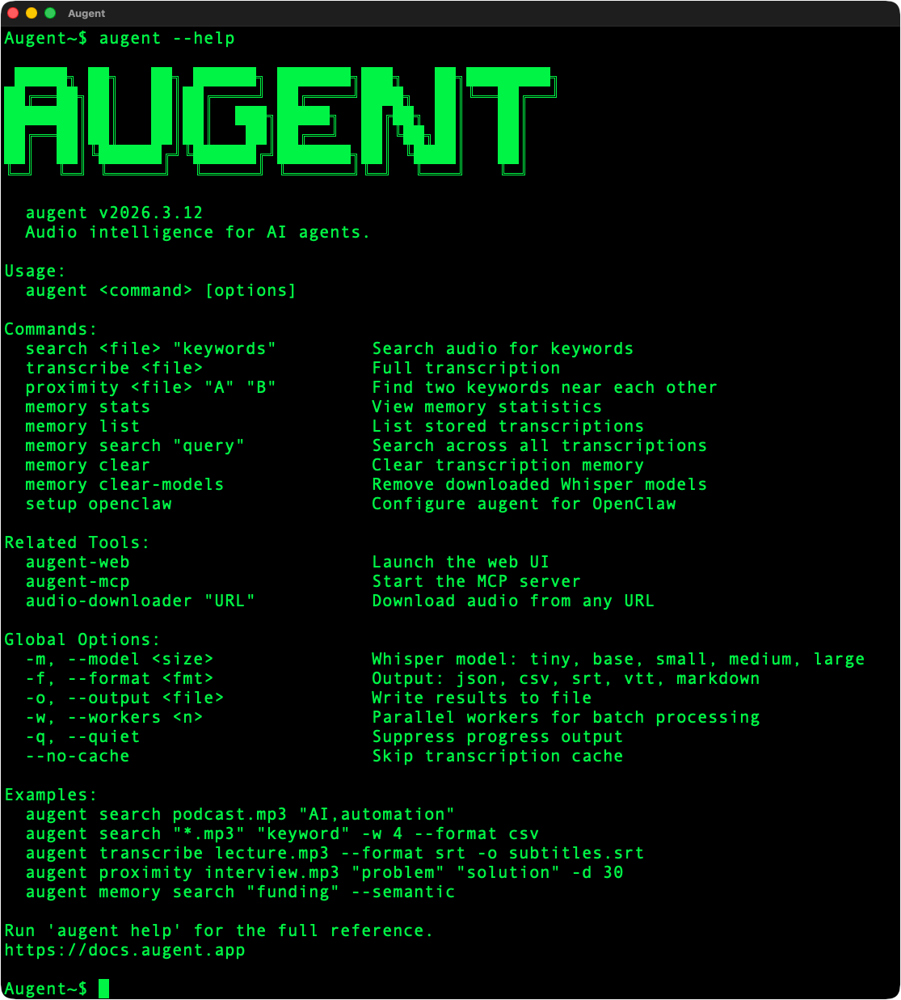
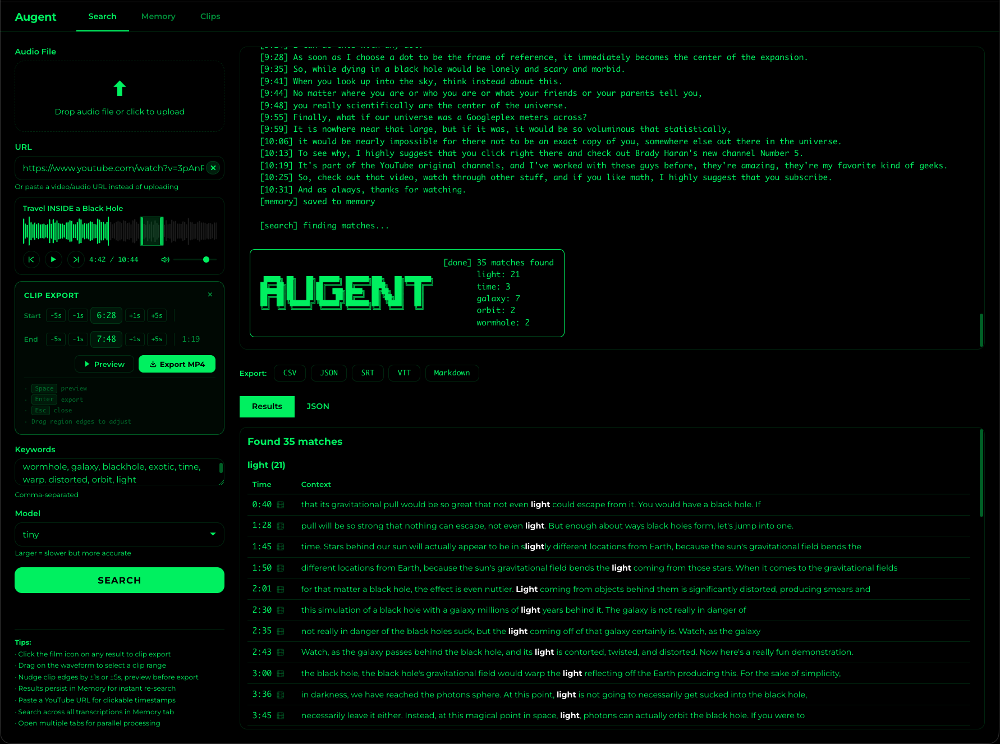
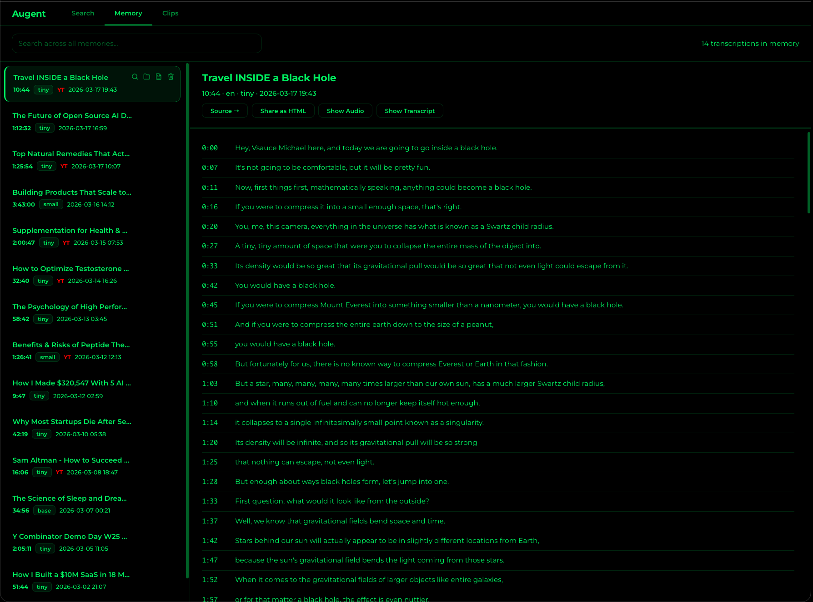

<p align="center">
  
</p>

<h1 align="center">Augent</h1>

<p align="center">
  <a href="https://github.com/AugentDevs/Augent/actions/workflows/tests.yml"></a>
  <a href="https://www.python.org/downloads/"></a>
  <a href="https://opensource.org/licenses/MIT"></a>
</p>

<p align="center"><strong>Audio intelligence for Claude Code agents and agentic swarms</strong><br>Built by <a href="https://augent.app">Augent</a></p>

An MCP-powered plugin that gives Claude Code the ability to transcribe, search, and analyze audio files locally.

---

## Install

```bash
curl -fsSL https://augent.app/install.sh | bash
```

Works on macOS and Linux. Installs everything automatically.

**Windows:** `pip install "augent[all] @ git+https://github.com/AugentDevs/Augent.git"`

**[Documentation](https://docs.augent.app)** — Full reference for all tools, CLI commands, and API

---

## Watch Nothing. Learn Everything.

No commands to memorize. No syntax to learn. Just ask Claude.

**You type:**
> "Here are some Huberman Lab episodes: [8 YouTube URLs]
>
> Download them to a new folder on my desktop called 'Huberman Podcasts'. Find every supplement he mentions, especially when he says 'I take' or 'recommend'. Include dosages and benefits. Give me a spreadsheet for product research."

**Claude does:**
1. Creates `~/Desktop/Huberman Podcasts/`
2. Downloads audio only (no video, small files)
3. Transcribes them locally
4. Searches for supplement names, "I take", "recommend", dosages, benefits
5. Returns a structured table for new advertising angles

**12 hours of content. Zero hours of listening. One prompt.**

This works for any domain: coding tutorials, design workflows, business courses, technical documentation buried in video format.

---

## Usage

Augent can be used in three ways:

| Mode | Best For |
|------|----------|
| **Claude Code (MCP)** | Automated agentic workflows - Claude transcribes and searches for you |
| **CLI** | Quick terminal-based searches and batch processing |
| **Web UI** | Visual interface for manual uploads and searches |

---

## Claude Code (MCP)

The primary way to use Augent. Claude Code gets direct access to audio intelligence tools.

### Setup

Add to `~/.claude.json` (global) or `.mcp.json` (project):

```json
{
  "mcpServers": {
    "augent": {
      "command": "python3",
      "args": ["-m", "augent.mcp"]
    }
  }
}
```

Restart Claude Code. Run `/mcp` to verify connection.

**Note:** If `python3` isn't found, use full path (e.g., `/usr/bin/python3` or `/opt/homebrew/bin/python3`).

### MCP Tools

Once configured, Claude has access to:

| Tool | Description |
|------|-------------|
| `download_audio` | Download audio from video URLs at maximum speed (YouTube, Vimeo, TikTok, etc.) |
| `search_audio` | Find keywords with timestamps and context snippets |
| `transcribe_audio` | Full transcription with metadata |
| `search_proximity` | Find where keywords appear near each other |
| `batch_search` | Search multiple files in parallel (for swarms) |
| `list_audio_files` | Discover audio files in a directory |
| `list_cached` | List cached transcriptions by title |
| `cache_stats` | View transcription cache statistics |
| `clear_cache` | Clear cached transcriptions |

### Example Workflow

Ask Claude: *"Download this YouTube tutorial and find where they talk about multiplayer"*

Claude will:
1. `download_audio` -> Downloads audio from the URL
2. `search_audio` -> Finds "multiplayer" mentions with timestamps
3. Returns results with exact timestamps and context

---

## CLI

For terminal-based usage. Works standalone or inside Claude Code.



### Commands

| Command | Description |
|---------|-------------|
| `audio-downloader URL` | Download audio from video URL to ~/Downloads |
| `augent search audio.mp3 "keyword"` | Search for keywords |
| `augent transcribe audio.mp3` | Full transcription |
| `augent proximity audio.mp3 "A" "B"` | Find keyword A near keyword B |
| `augent cache stats` | View cache info |
| `augent help` | Show full help |

---

## Web UI

Visual interface for manual use. Runs 100% locally - no cloud APIs, no Claude credits.

```bash
python3 -m augent.web
```

Open: **http://127.0.0.1:9797**

1. **Upload** an audio file (MP3, WAV, M4A, etc.)
2. **Enter keywords** separated by commas
3. **Click SEARCH**
4. **View results** with timestamps and context

| Command | Description |
|---------|-------------|
| `python3 -m augent.web` | Start on port 9797 |
| `python3 -m augent.web --port 3000` | Custom port |
| `python3 -m augent.web --share` | Create public link |




---

## audio-downloader

A speed-optimized audio downloader built by Augent. Downloads audio ONLY from any video URL at lightning speed.

```bash
audio-downloader "https://youtube.com/watch?v=xxx"
```

**Default:** Saves to `~/Downloads`. Use `-o` to change output folder.

**Speed Optimizations:**
- aria2c multi-connection downloads (16 parallel connections)
- Concurrent fragment downloading (4 fragments)
- No video download - audio extraction only
- No format conversion - native audio format for maximum speed

**Supports:** YouTube, Vimeo, SoundCloud, Twitter, TikTok, and 1000+ sites

---

## Model Sizes

**`tiny` is the default** - it's the fastest and already incredibly accurate for nearly every use case. You'll use it 99% of the time.

| Model | Speed | Accuracy | VRAM |
|-------|-------|----------|------|
| **tiny** | Fastest | Excellent (default) | ~1GB |
| base | Fast | Excellent | ~1GB |
| small | Medium | Superior | ~2GB |
| medium | Slow | Outstanding | ~5GB |
| large | Slowest | Maximum | ~10GB |

**When to use larger models:**
- Finding lyrics in a song you don't know the name of
- Very heavy accents or extremely poor audio quality
- Medical/legal transcriptions requiring maximum accuracy

**Warning:** `medium` and `large` models are very CPU/memory intensive. They can freeze or overheat lower-spec machines (like MacBook Air). Stick to `tiny` or `base` unless you have a powerful machine with good cooling.

`tiny` handles tutorials, interviews, lectures, ads with background music, and almost everything else perfectly fine.

## Caching

Transcriptions are cached to avoid re-processing:

```bash
augent cache stats
# {"entries": 42, "total_audio_duration_hours": 15.5, "cache_size_mb": 12.3}
```

Cache key = file hash + model size, so:
- Same file + same model = instant cache hit
- Same file + different model = new transcription
- Modified file = new transcription

## Export Formats

- **JSON** - Structured data, grouped by keyword
- **CSV** - Spreadsheet-ready
- **SRT** - SubRip subtitles
- **VTT** - WebVTT for web video
- **Markdown** - Human-readable reports

## Python API

```python
from augent import search_audio, transcribe_audio, search_audio_proximity

# Basic keyword search
results = search_audio("tutorial.mp3", ["install", "setup"])
# {"install": [{"timestamp": "2:34", "snippet": "...first install the dependencies..."}]}

# Full transcription
transcription = transcribe_audio("tutorial.mp3", model_size="small")

# Proximity search
matches = search_audio_proximity(
    "tutorial.mp3",
    keyword1="error",
    keyword2="fix",
    max_distance=30
)

# Export
from augent import export_matches
csv_output = export_matches(results, format="csv")
```

## License

MIT License - see [LICENSE](LICENSE) for details.
